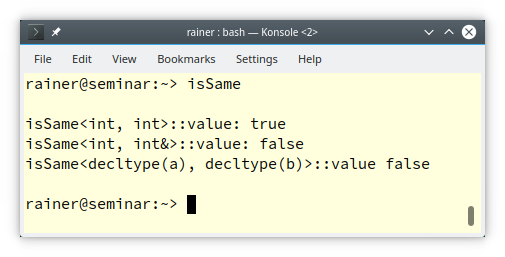
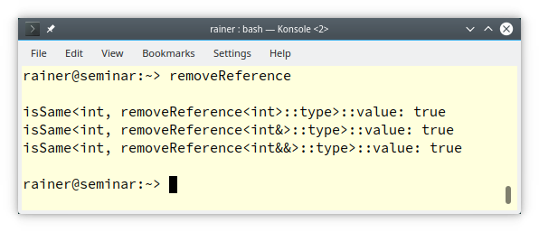
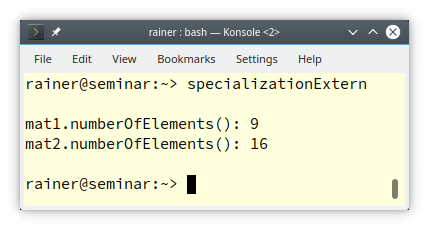

# C++ 模板 10：模板特例化中更多关于类模板的内容


上一篇文章“模板特例化”介绍了关于模板特例化的基础知识，今天我要对其深入挖掘。首先，我们来介绍用 类模板的偏特化和全特化 实现的编译期 if。

## 用类模板的特例化实现编译期 if

在上一篇文章之后，我收到了一些相似的问题：如何判断一个类型是指定类型？如何判断两个类型是否相同？回答这些问题比想象中的要容易，而且有助于我提出更多关于类模板特例化的理论。为了回答这些问题，我实现了 `std::is_same` 和 `std::remove_reference` 的简化版本。在这篇文章中介绍的技术是类模板特例化的一个应用，是一个编译期 if。

### `std::is_same`

`std::is_same` 是一个来自 type-traits 库的函数。如果两种类型相同，它返回 `std::true_type`，否则它返回`std::false_type`。为了简单起见，我返回 true 或 false。

```C++
// isSame.cpp

#include <iostream>

template<typename T, typename U>                 // (1)
struct isSame {
    static constexpr bool value = false;
};
 
template<typename T>                             // (2)
struct isSame<T, T> {
    static constexpr bool value = true;
}; 

int main() {

    std::cout << '\n';                          

    std::cout << std::boolalpha;
                                                // (3)
    std::cout << "isSame<int, int>::value: " << isSame<int, int>::value << '\n';
    std::cout << "isSame<int, int&>::value: " << isSame<int, int&>::value << '\n';
  
                                                
    int a(2011);
    int& b(a);                                  // (4)
    std::cout << "isSame<decltype(a), decltype(b)>::value " << 
                  isSame<decltype(a), decltype(b)>::value << '\n';

    std::cout << '\n';

}
```

主模板 (1) 默认返回 false。当两种类型都相同时，偏特化 (2) 会返回 true。如 (3) 所示，你可以向类模板 `isSame` 传入两个类型并判断两者是否相等；如 (4) 所示，利用 `decltype`，也可以判断两个值的类型。下面的截图显示了该程序的输出。



类模板 `isSame` 是模板元编程的一个例子。现在，我得绕个小弯，写几句关于“元”的内容。

### 元函数和元数据

在运行时，我们使用数据和函数。在编译时，我们使用元数据和元函数。很简单，之所以它被称为“元”，是因为我们在做元编程。但什么是元数据或元函数呢？首先做出定义：

- **元数据**: 在元函数中使用的类型和整型值。
- **元函数**: 在编译时被执行的函数。

下面我们进一步阐述元数据和元函数这两个概念。

#### 元数据

元数据包括三种实体。

1. 类型，如 `int`、`double` 或 `std::string`。
2. 非类型，如整型数值、枚举类型值、指针、左值引用，C++20 还包括浮点值。
3. 模板。

到目前为止，我只在我的元函数`isSame`中使用了类型。

#### 元函数

像类模板 `isSame` 这样的类型在模板元编程中被用来模拟函数。基于我对元函数的定义，`constexpr` 函数也可以在编译时执行，因此也是元函数。

一个元函数不但可以返回一个值，也可以返回一个类型。按照惯例，元函数通过 `::value` 返回一个值，通过 `::type` 返回一个类型。下面这个元函数 `removeReference` 返回一个类型作为结果。

```C++
// removeReference.cpp

#include <iostream>
#include <utility>

template<typename T, typename U>                 
struct isSame {
    static constexpr bool value = false;
};
 
template<typename T>                             
struct isSame<T, T> {
    static constexpr bool value = true;
}; 

template<typename T>                // (1)
struct removeReference { 
    using type = T;
};

template<typename T>               // (2)
struct removeReference<T&> {
    using type = T;
};

template<typename T>               // (3)
struct removeReference<T&&> {
    using type = T;
};

int main() {

    std::cout << '\n';

    std::cout << std::boolalpha;
                                    // (4)                
    std::cout << "isSame<int, removeReference<int>::type>::value: " << 
                  isSame<int, removeReference<int>::type>::value << '\n';

    std::cout << "isSame<int, removeReference<int&>::type>::value: " << 
                  isSame<int, removeReference<int&>::type>::value << '\n';

    std::cout << "isSame<int, removeReference<int&&>::type>::value: " << 
                  isSame<int, removeReference<int&&>::type>::value << '\n';


                                  // (5)

    int a(2011);
    int& b(a);   
    std::cout << "isSame<int, removeReference<decltype(a)>::type>::value: " << 
                  isSame<int, removeReference<decltype(a)>::type>::value << '\n';

    std::cout << "isSame<int, removeReference<decltype(b)>::type>::value: " << 
                  isSame<int, removeReference<decltype(b)>::type>::value << '\n';

    std::cout << "isSame<int, removeReference<decltype(std::move(a))>::type>::value: " << 
                  isSame<int, removeReference<decltype(std::move(a))>::type>::value << '\n';

    std::cout << '\n';

}
```

在这个例子中，我应用了之前定义的元函数 `isSame` 和元函数 `removeReference`。主模板 `removeReference` (1) 原样返回输入的类型 `T`。对左值引用 (2) 和对右值引用 (3) 的偏特化通过从它的模板参数中移除引用来返回 `T`。像以前一样，你可以用类型 (4) 来使用元函数 `removeReference`，并且利用 `decltype`，也可以用值 (5) 来使用之。`decltype(a)` 返回值类型，`decltype(b)` 返回左值引用类型，`decltype(std::move(a))` 返回右值引用类型。

最后是这个程序的输出。



## 在类定义体之外定义特例化成员函数

以下的内容是另外一个话题。这是一个小陷阱：当你在类外定义一个全特化的类模板的成员函数时，你一定不能写 `template<>`。

下面的代码程序显示了类模板 `Matrix`，有一个偏特化和一个全特化。

```C++
// specializationExtern.cpp

#include <cstddef>
#include <iostream>

template <typename T, std::size_t Line, std::size_t Column>  // (1)
struct Matrix;

template <typename T>                                        // (2)
struct Matrix<T, 3, 3>{
    int numberOfElements() const;
};

template <typename T>
int Matrix<T, 3, 3>::numberOfElements() const {
    return 3 * 3;
};

template <>                                                 // (3)
struct Matrix<int, 4, 4>{
    int numberOfElements() const;
};

// template <>                                              // (4)
int Matrix<int, 4, 4>::numberOfElements() const {
    return 4 * 4;
};

int main() {

    std::cout << '\n';

    Matrix<double, 3, 3> mat1;                              // (5)
    std::cout << "mat1.numberOfElements(): " << mat1.numberOfElements() << '\n';

    Matrix<int, 4, 4> mat2;                                 // (6)
    std::cout << "mat2.numberOfElements(): " << mat2.numberOfElements() << '\n';

    std::cout << '\n';
    
}
```

(1) 声明了主模板。(2)(3) 分别定义了 `Matrix` 的偏特化和全特化。成员函数 `numberOfElements` 定义在类定义体之外。第 (4) 行可能并不直观。当在类定义体之外定义成员函数 `numberOfElements` 时，不能使用 `template<>`。第 (5) 行导致偏特化模板的实例化，第 (6) 行导致全特化模板的实例化。



## 导航

[目录](目录.md)	[上一篇](模板9.md)	[下一篇](11.md)	[原文](http://www.modernescpp.com/index.php/template-specialization-more-details)

