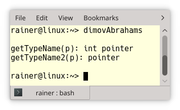
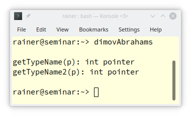
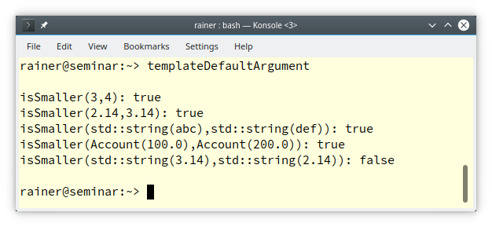

# C++ 模板 11：函数模板的全特化


你可能从我之前的文章“模板特例化”中知道，函数模板只能进行全特化，而不能进行偏特化。但我想说，不要将函数模板特例化，只需使用函数重载。

你可能想知道为什么我写的是C++的特性，却不应该使用。原因很简单，当你看到全特化的函数模板的行为时，你会希望使用一个非泛型的函数来代替。

## 不要特例化函数模板

或许这个标题能提醒你。它来自 C++ Core Guidelines: [T.144: Don’t specialize function templates](http://isocpp.github.io/CppCoreGuidelines/CppCoreGuidelines#Rt-specialize-function)。

规则背后的原因很简单：函数模板的特例化不参与重载。下面的程序是基于 Dimov/Abrahams 的程序片段。

```C++
// dimovAbrahams.cpp

#include <iostream>
#include <string>

// getTypeName

template<typename T>            // (1) - 主模板
std::string getTypeName(T){
    return "unknown";
}

template<typename T>            // (2) - 重载自 (1) 的主模板
std::string getTypeName(T*){
    return "pointer";
}

template<>                      // (3) - (2) 的显式特例化
std::string getTypeName(int*){
    return "int pointer";
}

// getTypeName2

template<typename T>            // (4) - 主模板
std::string getTypeName2(T){
    return "unknown";
}

template<>                      // (5) - (4) 的显式特例化
std::string getTypeName2(int*){
    return "int pointer";
}
 -
template<typename T>            // (6) - 重载自 (4) 的主模板
std::string getTypeName2(T*){
    return "pointer";
}

int main(){
    
    std::cout << '\n';
    
    int* p;
    
    std::cout << "getTypeName(p): " << getTypeName(p) <<  '\n';  
    std::cout << "getTypeName2(p): " << getTypeName2(p) <<  '\n';
    
    std::cout <<  '\n';
    
}
```

诚然，这段代码看起来很枯燥，但请忍一忍。我在内联中定义了主模板 `getTypeName` (1) 。(2) 是一个对指针形参的重载，(3) 是一个对int指针的全特化。在 `getTypeName2` 的情况下，我做了一个小小的改动。我把显式特例化 (5) 放在了对指针形参的重载 (6) 之前。

这种重新排序产生了令人惊讶的后果。



在第一种情况下，调用了int指针的全特化，在第二种情况下，调用了对指针形参的重载。 这种非直观的行为的原因是，重载解析不会考虑函数模板的特例化，只考虑主模板和普通函数。

* 在第一种情况下（getTypeName）：
  1. 重载解析会考虑 (1) 和 (2)。
     * o `template<typename T> std::string getTypeName(T);`      // (1) - 主模板
     * o `template<typename T> std::string getTypeName(T*); `    // (2) - 重载自 (1) 的主模板
     * x `template<> std::string getTypeName(int*);`                     // (3) - (2) 的显式特例化
  2. (2) 更合适，因此选择 (2)；
  3. (2) 拥有对int指针的特例化 (3)，因此选择 (3)。
* 在第二种情况下（getTypeName2）：
  1. 重载解析会考虑 (4) 和 (6)。
     * o `template<typename T> std::string getTypeName2(T);`      // (4) - 主模板
     * x `template<> std::string getTypeName2(int*);`                     // (5) - (4) 的显式特例化
     * o `template<typename T> std::string getTypeName2(T*);`    // (6) - 重载自 (4) 的主模板
  2. (6) 更合适，因此选择 (6)。
  3. (5) 是 (4) 的特例化，但因为 (4) 没有被选中，所以重载解析没有考虑之。

我知道，这很复杂。只要记住这个规则：不要对函数模板进行专业化处理，而要使用非泛型函数。

下面是证明：我只需要注释掉 (3) 和 (5) 中的模板声明 `template<>`。为了简单起见，我删除了其他的注释。

```C++
// dimovAbrahams.cpp

#include <iostream>
#include <string>

// getTypeName

template<typename T>           
std::string getTypeName(T){
    return "unknown";
}

template<typename T>            
std::string getTypeName(T*){
    return "pointer";
}
// template<>                      // (3)
std::string getTypeName(int*){
    return "int pointer";
}

// getTypeName2

template<typename T>           
std::string getTypeName2(T){
    return "unknown";
}
// template<>                      // (5) 
std::string getTypeName2(int*){
    return "int pointer";
}

template<typename T>           
std::string getTypeName2(T*){
    return "pointer";
}

int main(){
    
    std::cout << '\n';
    
    int* p;
    
    std::cout << "getTypeName(p): " << getTypeName(p) <<  '\n';  
    std::cout << "getTypeName2(p): " << getTypeName2(p) <<  '\n';
    
    std::cout <<  '\n';
    
}
```

现在，函数重载像预期的那样工作，接收int指针参数的非泛型函数被调用。



## 默认模板实参

我已经写了关于模板实参的文章。但我忘了一个重要的事实。你可以为函数模板和类模板提供默认的模板参数。

标准模板库（STL）的类模板中有许多模板参数都有默认值。

这里有几个例子。

```C++、
template<
    typename T,
    typename Allocator = std::allocator<T>
> class vector;

template<
    typename Key,
    typename T,
    typename Hash = std::hash<Key>,
    typename KeyEqual = std::equal_to<Key>,
    typename Allocator = std::allocator< std::pair<const Key, T>>
> class unordered_map;

template<
    typename T,
    typename Allocator = std::allocator<T>
> class deque;

template<
    typename T,
    typename Container = std::deque<T>
> class stack;

template<
    typename CharT,
    typename Traits = std::char_traits<CharT>,
    typename Allocator = std::allocator<CharT>
> class basic_string;
```

* 每个容器都有一个依赖其元素的默认分配器。

* 你必须指定所需的参数，如 `std::unordered_map` 的键类型和值类型：`std::unordered_map<std::string, int>`。

* 你可以使用一个特殊的哈希函数来实例化 `std::unordered_map`，该函数返回键的哈希值，以及一个特殊的二进制谓词来确定两个键是否相等：`std::unordered_map<std::string, int, MyHash>`，或者`std::unordered_map<std::string, int, MyHash, MyBinaryPredicate>`。

* `std::string` 只是一个别名。下面是基于 `std::basic_string` 的别名：

  ```C++
  std::string         std::basic_string<char>
  std::wstring 	    std::basic_string<wchar_t>
  std::u8string 	    std::basic_string<char8_t>  (C++20)
  std::u16string      std::basic_string<char16_t> (C++11)
  std::u32string      std::basic_string<char32_t> (C++11)
  ```

当然，当一个模板参数有默认值时，其后面的模板参数也必须有默认值。

到目前为止，我只写了关于类模板的默认模板参数。我想用一个函数模板的例子来结束这篇文章。

假设我想判断两个具有相同类型的对象哪一个更小。像 `isSmaller` 这样的算法是一个泛型的想法，因此，它应该是一个模板。

```C++
// templateDefaultArguments.cpp

#include <functional>
#include <iostream>
#include <string>

class Account{
public:
  explicit Account(double b): balance(b){}
  double getBalance() const {
    return balance;
  }
private:
  double balance;
};

template <typename T, typename Pred = std::less<T>>                        // (1)
bool isSmaller(T fir, T sec, Pred pred = Pred() ){
  return pred(fir,sec);
}

int main(){

  std::cout << std::boolalpha << '\n';

  std::cout << "isSmaller(3,4): " << isSmaller(3,4) << '\n';                // (2) 
  std::cout << "isSmaller(2.14,3.14): "  << isSmaller(2.14,3.14) << '\n';
  std::cout << "isSmaller(std::string(abc),std::string(def)): " << 
                isSmaller(std::string("abc"),std::string("def")) << '\n';

  bool resAcc= isSmaller(Account(100.0),Account(200.0),                     // (3)
               [](const Account& fir, const Account& sec){ return fir.getBalance() < sec.getBalance(); });
  std::cout << "isSmaller(Account(100.0),Account(200.0)): " << resAcc << '\n';

  bool acc= isSmaller(std::string("3.14"),std::string("2.14"),              // (4)
            [](const std::string& fir, const std::string& sec){ return std::stod(fir) < std::stod(sec); });
  std::cout << "isSmaller(std::string(3.14),std::string(2.14)): " << acc << '\n';

  std::cout << '\n';

}
```

在默认情况下 (2)，`isSmaller` 按预期工作。 `isSmaller` (1) 使用模板参数 `std::less`，这是STL中诸多预定义的函数对象之一，它对其参数应用小于运算符。为了使用它，我需要在下面一行中实例化 `std::less<T>`：`Pred pred = Pred()`。

由于默认的模板参数，我可以比较 `Accont`（3）或字符串（4）。`Accont` 不支持小于运算符，但如 (3) 所示还是可以比较 `Accont`。此外，我不想按词典比较字符串，而是根据其内部编号进行比较 (4)。提供 (3) 和 (4) 中的两个lambda表达式作为二元谓词成功地完成了我的工作。



## 导航

[目录](目录.md)	[上一篇](10.md)	[下一篇](12.md)	[原文](http://www.modernescpp.com/index.php/full-specialization-of-function-templates)

