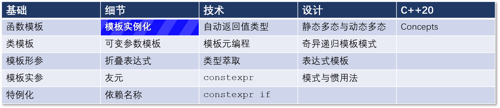
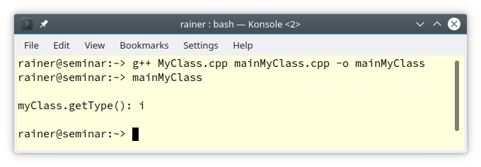

# C++ 模板 12：模板实例化



模板实例化是指从一个函数模板或类模板中创建一个具体的函数或一个具体的类。模板的实例化可以是隐式的（编译器生成的）或显式的（用户提供的）。

## 隐式实例化

隐式实例化应该是你的默认选择。隐式实例化意味着编译器会自动使用提供的模板实参生成具体的函数或类。一般来说，编译器也会从函数的实参中推导出模板实参。在 C++17 中，编译器也可以推导出类模板的模板实参。

```C++
// implicitTemplateInstantiation.cpp

#include <iostream>
#include <string>
#include <vector>

template <typename T>
class MyClass{
 public:
    MyClass(T t) { }
    std::string getType() const {
        return typeid(T).name();
    }
};

template<typename T>
bool isSmaller(T fir, T sec){
    return fir < sec;
}

int main(){

    std::cout << '\n';

    std::cout << std::boolalpha;
  
    std::vector vec{1, 2, 3, 4, 5};          // (1)
    std::cout << "vec.size(): " << vec.size() << '\n';
  
    MyClass myClass(5);                      // (2)
    std::cout << "myClass.getType(): " << myClass.getType() << '\n';
  
    std::cout << '\n';
  
    std::cout << "isSmaller(5, 10): " 
              << isSmaller(5, 10) << '\n';   // (3)
    std::cout << "isSmaller<double>(5.5f, 6.5): " 
              << isSmaller<double>(5.5f, 6.5) << '\n';    // (4)
  
    std::cout << '\n';
  
}
```

第 (1) 行和第 (2) 行使用了类模板参数推导。第 (3) 行也推导出了它的模板参数。而在第 (4) 行，模板参数double被明确指定：`isSmaller<double>(5.5f, 6.5)`。

编译器为每个隐式模板实例化创建一个具体的函数或类。[C++ Insights](https://cppinsights.io/s/e8145723)

这个自动过程非常舒适，但也有一些缺点。

* 当你隐式实例化一个模板时，模板的定义通常在头文件中可见。也许，你不想公开这个定义。
* 当你需要一个特定的模板实参时，如果它在具体的翻译单元中不可用，编译器就会实例化。一个翻译单元是C预处理器处理后的源文件。通常情况下，链接器会删除所有多余的模板实例并保留一个。这是对时间和空间的浪费。

这两个问题都可以通过显式模板实例化来解决。

## 显式实例化

显式实例化有两种风格：显式实例化定义和显式实例化声明。

显式实例化定义的语法：` template <template declaration> `
显式实例化声明的语法：`  extern template <template declaration> `

差别在于关键字 `extern`。

显式实例化声明在本文后面会提到，先来讲显式实例化定义。

```C++
// explicitTemplateInstantiation.cpp

#include <iostream>
#include <string>
#include <vector>

template <typename T>
class MyClass{
 public:
    MyClass(T t) { }
    std::string getType() const {
        return typeid(T).name();
    }
};

template<typename T>
bool isSmaller(T fir, T sec){
  return fir < sec;
}
 
template class std::vector<int>;                       // (1)
template bool std::vector<double>::empty() const;      // (2)

template class MyClass<int>;                           // (3)
template std::string MyClass<double>::getType() const; // (4)

template bool isSmaller(int, int);                     // (5)
template bool isSmaller<double>(double, double);       // (6)

int main(){

  std::cout << '\n';
  
  std::cout << std::boolalpha;
  
  std::vector vec{1, 2, 3, 4, 5};
  std::cout << "vec.size(): " << vec.size() << '\n';
  
  MyClass myClass(5);
  std::cout << "myClass.getType(): " << myClass.getType() << '\n';
  
  std::cout << '\n';
  
  std::cout << "isSmaller(5, 10): " 
            << isSmaller(5,10) << '\n';
  std::cout << "isSmaller<double>(5.5f, 6.5): " 
            << isSmaller<double>(5.5f, 6.5) << '\n';
  
  std::cout << '\n';
  
}
```

请关注注释标出的 (1)-(6) 行，这几行代码进行了模板的显式实例化。

第 (1) 行显式实例化了接收 `int` 类型的 `std::vector`；第 (2) 行显式实例化了`std::vector<double>` 的成员  `empty`。

第 (3) 行显式实例化了接收 `int` 类型的 `MyClass`；第 (4) 行显式实例化了`MyClass<double>` 的成员  `getType `。

第 (5) 行实例化了接收 `(int, int)` 类型的 `Smaller`；第 (6) 行显示提供了模板实参 `double` 完成了同样的事情。

### 隐藏模板的实现

显式模板实例化可以帮助我们隐藏模板的定义。

1、把模板声明放在头文件。
2、把模板定义放在源文件。在源文件的末尾进行显式模板实例化。
3、包含头文件来使用模板。

这里有三个文件示范了这个过程：

```C++
// MyClass.h

#include <typeinfo>
#include <string>

template <typename T>
class MyClass{
 public:
    MyClass(T t) { }
    std::string getType() const;
};
```

```C++
// MyClass.cpp

#include "MyClass.h"

template <typename T>
std::string MyClass<T>::getType() const {
    return typeid(T).name();
}

template class MyClass<int>; 
```

```C++
// mainMyClass.cpp

#include "MyClass.h"
#include <iostream>

int main() {

    std::cout << '\n'; 

    MyClass myClass(5);
    std::cout << "myClass.getType(): " << myClass.getType() << '\n';

    /*
    MyClass myClass2(5.5);
    std::cout << "myClass2.getType(): " << myClass2.getType() << '\n';
    */

    std::cout << '\n';

}
```

运行该程序可以得到预期的结果。



但是当我试图对 `int` 以外的其他类型使用 `MyClass` 时，链接器会报出错误。如果让上方代码中注释掉的行生效就会得到这样的报错，原因是没有可用于接收 `double` 类型的模板实例化。 

## 抑制模板实例化

假设你在不同的编译单元中使用 `MyClass<int>`，链接器将其放在一起。本质上，链接器只留了下一个模板实例，其余的都被丢弃了。这是对计算时间的浪费。在C++11中，可以使用了extern关键字，从一个显式模板实例化定义中做出一个显式模板实例化声明。

```C++
template class MyClass<int>;        // 显式模板实例化定义
extern template class MyClass<int>; // 显式模板实例化声明
```

第二行并没有引起模板实例化，因此编译器生成的东西不会被链接器扔掉。你只需要确保链接器可以获得 `MyClass<int>` 的一个实例化。如果没有，链接器就会报错。

## 下一篇

下一篇文章将叙述可变参数模板。

## 导航

[目录](目录.md)	[上一篇](11.md)	[下一篇](13.md)	[原文](http://www.modernescpp.com/index.php/template-instantiation)

