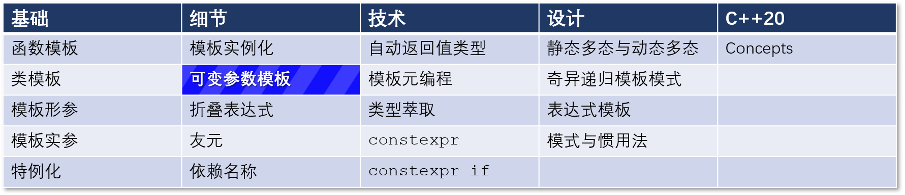

# C++ 模板 14： 有关可变参数模板的更多内容...

## 导航

[目录](https://github.com/yqZhang4480/TranslateBlogs/blob/master/CPP_Templates/目录.md)	[上一篇](https://github.com/yqZhang4480/TranslateBlogs/blob/master/CPP_Templates/13.md)	[下一篇](https://github.com/yqZhang4480/TranslateBlogs/blob/master/CPP_Templates/15.md)	[原文](http://www.modernescpp.com/index.php/more-arbout-variadic-templates)

