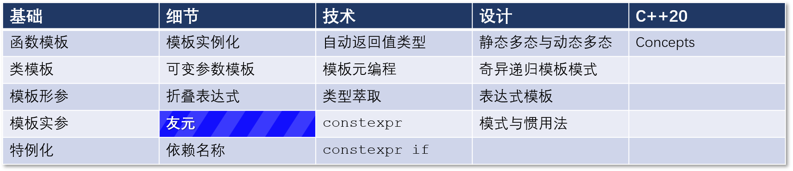

# C++ 模板 18：模板的特别友元

## 导航

[目录](https://github.com/yqZhang4480/TranslateBlogs/blob/master/CPP_Templates/目录.md)	[上一篇](https://github.com/yqZhang4480/TranslateBlogs/blob/master/CPP_Templates/17.md)	[下一篇](https://github.com/yqZhang4480/TranslateBlogs/blob/master/CPP_Templates/19.md)	[原文](http://www.modernescpp.com/index.php/special-friendship-of-templates)

