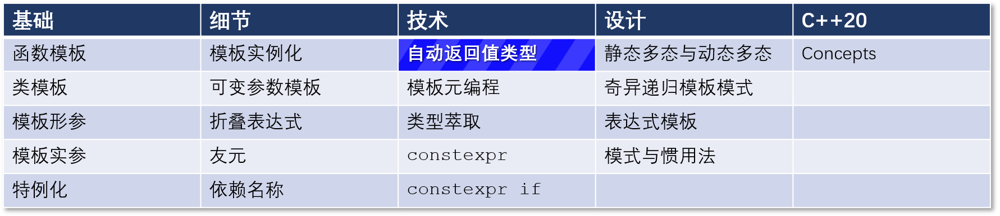

# C++ 模板 21：现代 C++ 的自动返回值类型

## 导航

[目录](https://github.com/yqZhang4480/TranslateBlogs/blob/master/CPP_Templates/目录.md)	[上一篇](https://github.com/yqZhang4480/TranslateBlogs/blob/master/CPP_Templates/20.md)	[下一篇](https://github.com/yqZhang4480/TranslateBlogs/blob/master/CPP_Templates/22.md)	[原文](http://www.modernescpp.com/index.php/automatic-return-type-c-11-14-20)

