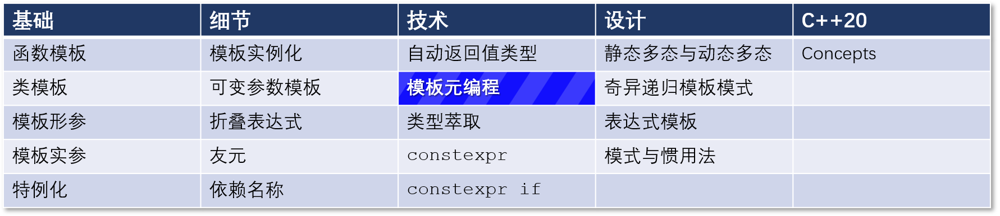

# C++ 模板 24：模板元编程——混合编程

## 导航

[目录](https://github.com/yqZhang4480/TranslateBlogs/blob/master/CPP_Templates/目录.md)	[上一篇](https://github.com/yqZhang4480/TranslateBlogs/blob/master/CPP_Templates/23.md)	[下一篇](https://github.com/yqZhang4480/TranslateBlogs/blob/master/CPP_Templates/25.md)	[原文](http://www.modernescpp.com/index.php/template-metaprogramming-hybrid-programming)

