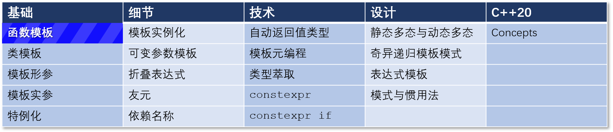
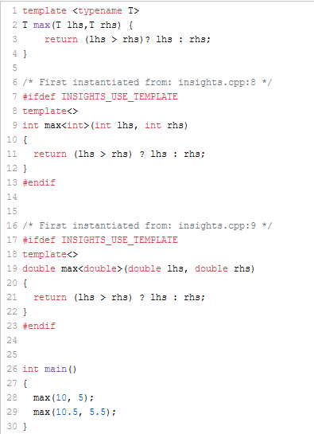
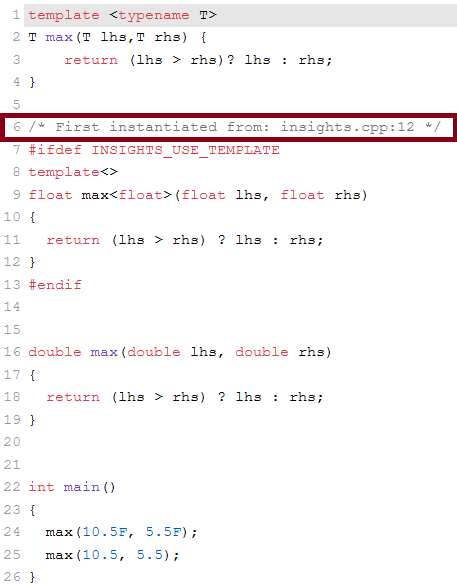
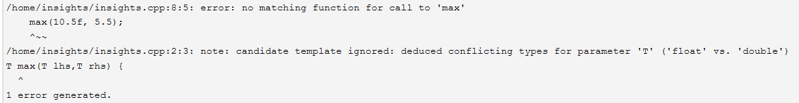
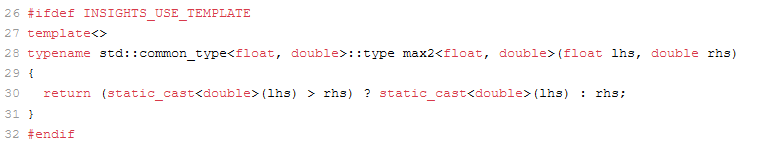
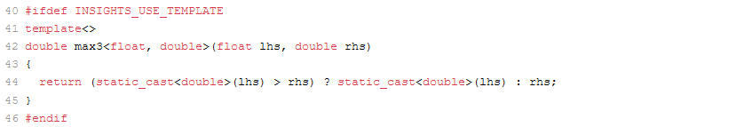

# C++ 模板 2：函数模板



函数模板是一系列函数的统一表述。这篇文章将深入探讨函数模板。

举个实例化函数模板的例子，为 `int` 和 `double` 类型实例化的 `max` 函数：

```C++
template <typename T>
T max(T lhs, T rhs)
{
    return (lhs > rhs)? lhs : rhs;
}

int main()
{
    max(10, 5);
    max(10.5, 5.5);
}
```

编译器为 `int` 和 `double` 各自生成了完全专用的函数模板：`max<int>` 和 `max<double>`。我们看看 C++ Insights insights 出了什么：

  

 现在我们可以深入了解其中的细节了。 首先我们来回答一个问题：当函数模板和普通函数重载时会发生什么？  

## 函数模板和普通函数的重载

```C++
template <typename T>
T max(T lhs,T rhs)
{
    return (lhs > rhs)? lhs : rhs;
}
double max(double lhs, double rhs)
{
    return (lhs > rhs)? lhs : rhs;
}

int main()
{
    max(10.5f, 5.5f); // (*)
    max(10.5, 5.5);   // (**)
}
```

你应该可以猜到我会对这段代码提出什么问题：第 (\*) 行和第 (\*\*) 行会在编译时造成什么样的影响？具体来说：

* (\*) 行：编译器是选择函数模板还是函数并将浮点值提升为双精度？
* (\*\*) 行：函数和函数模板都完全合适。这样的代码似乎模棱两可，可能导致编译器错误。

问题的答案非常直观，遵循C++中的一般规则：编译器会选择最适合的函数。具体来说：

* (\*) 行：函数模板更合适，因为匹配普通函数需要将 `float` 提升到 `double`。
* (\*\*) 行：函数模板和函数都完全合适， 此时有一条额外规则：当两者同样适合时，编译器更倾向于选择函数。  

 依照惯例， [C++ Insights](https://cppinsights.io/lnk?code=dGVtcGxhdGUgPHR5cGVuYW1lIFQ+ClQgbWF4KFQgbGhzLFQgcmhzKSB7CiAgICByZXR1cm4gKGxocyA+IHJocyk/IGxocyA6IHJoczsKfQoKZG91YmxlIG1heChkb3VibGUgbGhzLCBkb3VibGUgcmhzKSB7CiAgICByZXR1cm4gKGxocyA+IHJocyk/IGxocyA6IHJoczsKfQoKaW50IG1haW4oKSB7CiAgCiAgICBtYXgoMTAuNWYsIDUuNWYpOwogICAgbWF4KDEwLjUsIDUuNSk7CiAgCn0KCg==&insightsOptions=cpp2a&std=cpp2a&rev=1.0) 有助于将这个过程可视化。  

  

屏幕截图明确显示了这一点。只有使用带有 `float` 的函数模板 `max`（第 (\*) 行）才会触发函数模板的实例化。

让我们进一步了解函数模板的基本知识。

第一条免责声明：这篇文章忽略了 C++ 20 中的概念（concept）。

## 不同的函数实参

我们来用函数模板 `max` 处理两个不同类型的值。

```C++
template <typename T>
T max(T lhs,T rhs)
{
    return (lhs > rhs)? lhs : rhs;
}

int main()
{
    max(10.5f, 5.5);
}
```

在 [C++ Insights](https://cppinsights.io/lnk?code=dGVtcGxhdGUgPHR5cGVuYW1lIFQ+ClQgbWF4KFQgbGhzLFQgcmhzKSB7CiAgICByZXR1cm4gKGxocyA+IHJocyk/IGxocyA6IHJoczsKfQoKaW50IG1haW4oKSB7CiAgCiAgICBtYXgoMTAuNWYsIDUuNSk7CiAgCn0KCg==&insightsOptions=cpp2a&std=cpp2a&rev=1.0) 里跑一下： 

 

为什么这里的 `float` 没有提升到 `double` 呢？实际上，编译器的想法和我们的不一样。

编译器会尽可能从函数参数推导出模板参数。这种情况就是“可能”的。

* 编译器为每个函数参数做这个模板参数推导的过程。
* 对于 10.5f，编译器为 `T` 推导出了 `float`，对于 5.5，编译器为 `T` 推导出了 `double`。
* 显然，`T` 不可能同时是 `float` 和 `double`。 由于这种歧义，编译失败。 

第二条免责声明：本文简化了模板参数推导的过程。我会另写一篇关于函数模板和类模板的模板参数推导的文章。

## 两种类型的形参

解决办法似乎很简单。我只是引入了第二个类型参数。

```C++
template <typename T1, typename T2>
??? max(T1 lhs,T2 rhs) {
    return (lhs > rhs) ? lhs : rhs;
}

int main()
{
    max(10.5f, 5.5);
}
```

这很简单，但有一个严重的问题。注意返回类型标出了三个问号——返回类型应该是什么？在这个具体案例中，返回类型应该是 `T1`、`T2`，还是从 `T1` 和 `T2` 派生的 `R` ？在 C++11 之前，这是一个具有挑战性的任务，但在 C++11 中，解决方案就很简单了。

下面是我想到的几个解决方案。

```C++
// automaticReturnTypeDeduction.cpp
#include <type_traits>

template <typename T1, typename T2>     // (*)
typename std::conditional<(sizeof(T1) > sizeof(T2)), T1, T2>::type
    max1(T1 lhs,T2 rhs)
{
    return (lhs > rhs) ? lhs : rhs;
}
template <typename T1, typename T2>      // (**)
typename std::common_type<T1, T2>::type
    max2(T1 lhs,T2 rhs)
{
    return (lhs > rhs) ? lhs : rhs;
}
template <typename T1, typename T2>     // (***)
auto max3(T1 lhs,T2 rhs)
{
    return (lhs > rhs) ? lhs : rhs;
}

int main()
{
    max1(10.5f, 5.5);
    max2(10.5f, 5.5);
    max3(10.5f, 5.5);
}
```

前两个版本 `max1` 和 `max2` 基于 type-traits 库，第三个版本 `max3` 使用 `auto` 的自动类型推导。 （返回值的自动类型推导是 C++ 14 才有的新特性，译注）

* `max1`：`typename std::conditional<(sizeof(T1) > sizeof(T2)), T1, T2>::type` 返回 `T1` 和 `T2` 中占用空间更大的类型。 `std::conditional` 是一种编译期的三元运算符。 
* `max2`：`typename std::common_type<T1, T2>:type` 返回类型 `T1` 和 `T2` 的公共类型，`std::common_type` 可以接受任意数量的参数。
* `max3`：`auto` 应该就不用说了。

也许你会对函数模板 `max1` 和 `max2` 的返回类型前面的 `typename` 感到烦恼。T1和T2是依赖名称。什么是依赖名称？一个依赖名称本质上是一个依赖于模板参数的名称，不一定就是一个类型名称，也可以是非类型或模板。因此，我们必须明示编译器 `T1` 和 `T2` 是类型。

第三个免责声明：我将另写一篇关于依赖类型的文章。

让我们看看 C++ Insights 提供了什么。我只展示了模板实例化。如果你想分析整个程序，请点击 [C++ Insights](https://cppinsights.io/lnk?code=Ly8gYXV0b21hdGljUmV0dXJuVHlwZURlZHVjdGlvbi5jcHAKCiNpbmNsdWRlIDx0eXBlX3RyYWl0cz4KCnRlbXBsYXRlIDx0eXBlbmFtZSBUMSwgdHlwZW5hbWUgVDI+ICAgICAgLy8gKDEpCnR5cGVuYW1lIHN0ZDo6Y29uZGl0aW9uYWw8KHNpemVvZihUMSkgPiBzaXplb2YoVDIpKSwgVDEsIFQyPjo6dHlwZSBtYXgxKFQxIGxocyxUMiByaHMpIHsKICAgIHJldHVybiAobGhzID4gcmhzKT8gbGhzIDogcmhzOwp9Cgp0ZW1wbGF0ZSA8dHlwZW5hbWUgVDEsIHR5cGVuYW1lIFQyPiAgICAgIC8vICgyKQp0eXBlbmFtZSBzdGQ6OmNvbW1vbl90eXBlPFQxLCBUMj46OnR5cGUgbWF4MihUMSBsaHMsVDIgcmhzKSB7CiAgICByZXR1cm4gKGxocyA+IHJocyk/IGxocyA6IHJoczsKfQoKdGVtcGxhdGUgPHR5cGVuYW1lIFQxLCB0eXBlbmFtZSBUMj4gICAgIC8vICgzKQphdXRvIG1heDMoVDEgbGhzLFQyIHJocykgewogICAgcmV0dXJuIChsaHMgPiByaHMpPyBsaHMgOiByaHM7Cn0KCmludCBtYWluKCkgewogIAogIAltYXgxKDEwLjVmLCA1LjUpOyAgICAgICAgICAgICAgICAgIAogICAgbWF4MigxMC41ZiwgNS41KTsgICAgICAgICAgICAgICAgICAKICAgIG1heDMoMTAuNWYsIDUuNSk7ICAgICAgICAgICAgICAgICAgCiAgCn0=&insightsOptions=cpp2a&std=cpp2a&rev=1.0)。

- `max1`：在返回语句中，较小的类型 `float` 被转换为了 `double`。
- `max2`：和 `max1` 一样，`float` 值被转换为 `double`。

- `max3`：现在，我们可以明确地看到返回类型就是 `double`。

## 下一篇

在本文中，我通过使用一个以上的类型参数解决了不同类型的函数参数的挑战。下一篇中，我将采取不同的方法，明确地指定模板参数。

## 导航

[目录](https://github.com/yqZhang4480/TranslateBlogs/blob/master/CPP_Templates/目录.md)	[上一篇](https://github.com/yqZhang4480/TranslateBlogs/blob/master/CPP_Templates/模板1.md)	[下一篇](https://github.com/yqZhang4480/TranslateBlogs/blob/master/CPP_Templates/模板3.md)	[原文](http://www.modernescpp.com/index.php/function-templates)

