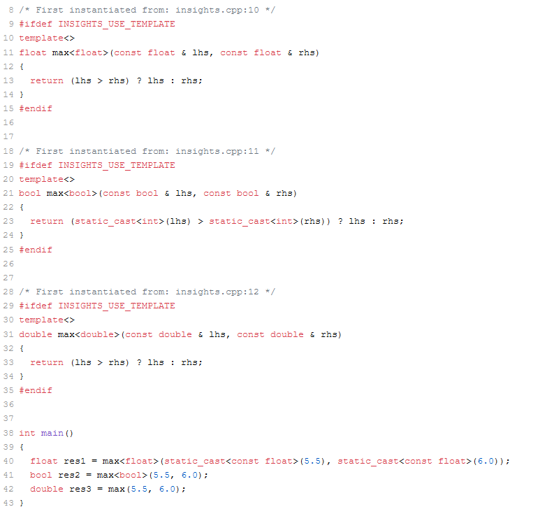
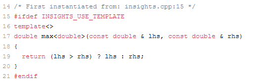

# C++ 模板 3： 有关显式模板参数和概念的更多内容


上一篇文章说明了函数模板的重载和自动推断函数模板的返回类型。这篇文章将深入研究并明确指定函数模板的模板参数，并将概念（concept）引入其中。

在开始这篇文章之前，我必须先说两个一般性的原则。一个是“不要”、一个是“要”：

* 不要：一般来说，你不应该显式指定函数模板的实参。
* 要：一般来说，你应该尽可能使用概念限制模板形参。

我们先从“不要”说起。

## 显式指定模板实参

你可以显式地指定模板实参。如果编译器不能推断出函数模板的类型参数，或者使用了类模板，那就必须显式指定模板实参。在 C++17 中，编译器可以从构造函数参数中自动推导出模板参数的类型。 

```C++
std::vector<int> myVec{1, 2, 3, 4, 5};  // (1)
std::vector myVec{1, 2, 3, 4, 5};       // (2)
```

在 C++ 17 中，可以用第二行代替第一行。后续文章将会进一步说明这一点。

再说一遍，一般来说，你不应该显式指定函数模板的实参，但我故意这样做了：

```C++
// maxExplicitTypeParameter.cpp
template <typename T>
T max(const T& lhs,const T& rhs)
{
    return (lhs > rhs)? lhs : rhs;
}

int main()
{
  auto res1 = max<float>(5.5, 6.0);   // (1)
  auto res2 = max<bool>(5.5, 6.0);    // (2)
  auto res3 = max(5.5, 6.0);          // (3)
}
```

 第 (1) - (3) 行发生了什么呢？ [C++ Insights](https://cppinsights.io/lnk?code=Ly8gbWF4RXhwbGljaXRUeXBlUGFyYW1ldGVyLmNwcAoKdGVtcGxhdGUgPHR5cGVuYW1lIFQ+ClQgbWF4KFQgbGhzLFQgcmhzKSB7CiAgICByZXR1cm4gKGxocyA+IHJocyk/IGxocyA6IHJoczsKfQoKaW50IG1haW4oKSB7CiAgCiAgYXV0byByZXMxID0gbWF4PGZsb2F0Pig1LjUsIDYuMCk7CiAgYXV0byByZXN0MiA9IG1heDxib29sPig1LjUsIDYuMCk7CiAgYXV0byByZXMzID0gbWF4KDUuNSwgNi4wKTsKICAKfQ==&insightsOptions=cpp11&std=cpp11&rev=1.0) 会给出答案：

  

- (1) 中的调用 `max<float>(5.5, 6.0)` 导致函数模板 `max` 实例化为 `max<float>`（第 10 行）， 因此，两个 `double` 都被转换为 `const float`（第 40 行）。 
- (2) 中的调用 `max<bool>(5.5, 6.0)` 使编译器承担了大量的工作：
  1. 调用会导致编译器隐式地将 `double` 转换为 `bool`。
  2. 要比较函数体中的两个布尔值，必须将它们提升为 `int`（第23行）。
  3. 最后，返回类型 `res2` 是 `bool`。因此，`int` 必须转换为 `bool`。
- (3) 中的调用 `max(5.5, 6.0)` 正是想要的结果。没有必要进行转换或提升。

不过话说回来，应该不会有人故意写出 `max<bool>(5.5, 6.0)` 这样的代码来。但是如果有人觉得他比编译器更聪明，这种情况倒是也可能会发生。

有些时候，可能会看到一种与模板参数的明确规范相关的语法：`max<>(5.5, 6.0)`。

考虑有一个函数和一个函数模板 `max`。

```C++
// maxCompilerDeduction.cpp
double max(const double& lhs, const double& rhs)
{
  return (lhs > rhs)? lhs : rhs;
}
template <typename T>
T max(const T& lhs,const T& rhs)
{
    return (lhs > rhs)? lhs : rhs;
}

int main()
{
  auto res1 = max(5.5, 6.0);    // (1)
  auto res2 = max<>(5.5, 6.0);  // (2)
}
```

正如我们在上一篇文章中所学到的，当函数和函数模板都是理想的匹配时，编译器更倾向于使用函数。好的，这就是 (1) 的答案。(2) 表示，编译器应该只考虑函数模板而忽略函数。此外，编译器会自动推断出函数参数的模板参数。因此， [C++ Insights](https://cppinsights.io/lnk?code=Ly8gbWF4Q29tcGlsZXJEZWR1Y3Rpb24uY3BwCgpkb3VibGUgbWF4KGNvbnN0IGRvdWJsZSYgbGhzLCBjb25zdCBkb3VibGUmIHJocykgewogIHJldHVybiAobGhzID4gcmhzKT8gbGhzIDogcmhzOwp9Cgp0ZW1wbGF0ZSA8dHlwZW5hbWUgVD4KVCBtYXgoY29uc3QgVCYgbGhzLGNvbnN0IFQmIHJocykgewogICAgcmV0dXJuIChsaHMgPiByaHMpPyBsaHMgOiByaHM7Cn0KCmludCBtYWluKCkgewogIAogIGF1dG8gcmVzMSA9IG1heCg1LjUsIDYuMCk7CiAgYXV0byByZXMyID0gbWF4PD4oNS41LCA2LjApOwogIAp9&insightsOptions=cpp11&std=cpp11&rev=1.0) 显示，编译器为 `double` 实例化了 `max`。

  

到目前为止，我只考虑了函数和具有不受限制的类型参数的函数模板的重载。接下来，我将说明涉及概念的重载。正如之前所说，应该尽可能使用概念限制模板形参。

## 涉及概念的重载

C++20 中有一个 `std::totally_ordered` 的概念。如果类型 `T` 中具有偏序关系，并且 `T` 的任何元素都可以被该偏序关系比较，则称类型 `T` 具有全序关系。正式地说：

对于具有关系 R 的类型 `T`，如果对其中任意元素 a，b，c 有下列陈述成立，则称类型 `T` 具有偏序关系：

1. aRa (自反性)
2. 若 aRb 且 bRc 则 aRc (传递性)
3. 若 aRb 且 bRa 则 a == b (反对称性)

对于具有偏序关系 R 的类型 `T`，如果对其中任意元素 a，b，要么 aRb 成立，要么 bRa 成立（即类型 `T` 中所有元素均可被 R 比较），则称类型 `T` 具有全序关系。如果你理解起来有点困难，就把上边的 R 换成 `<=`，可以发现这几个条件对于 `int` 类型是显然成立的。在面向对象编程中，关系 R 往往就是指 `<=`。（本段没有按照原文翻译，译注）

回到我们的主题上来，下面的代码使用了 `std::totally_ordered`：

```C++
// maxUnconstrainedConstrained.cpp
#include <iostream>
#include <concepts>

class Account
{
public:
    explicit Account(double b): balance(b) {}
    double getBalance() const
    { 
        return balance;
    }
private:
    double balance;
};
Account max(const Account& lhs, const Account& rhs)    // (1)
{
    std::cout << "max function\n";
    return (lhs.getBalance() > rhs.getBalance()) ? lhs : rhs;
}

template <std::totally_ordered T>                       // (2)
T max(const T& lhs,const T& rhs)
{                     
    std::cout << "max restricted function template\n";
    return (lhs > rhs) ? lhs : rhs;
}
template <typename T>                                   // (3)
T max(const T& lhs,const T& rhs)
{                   
    std::cout << "max unrestriced function template\n";
    return (lhs > rhs) ? lhs : rhs;
}

int main()
{
    Account account1(50.5);
    Account account2(60.5);
    Account maxAccount = max(account1, account2);       // (4)
  
    int i1{50};
    int i2(60);
    int maxI = max(i2, i2);                             // (5)
}
```

该程序定义了一个取两个 `Account` 的函数 `max`（第 (1) 行），以及两个函数模板。第 (2) 行中的第一个函数模板 `max` 要求参数类型具有全序关系。第二个函数模板 `max` 对其类型参数没有类型限制。正如你所期望的，编译器选择了最适合的重载。如果函数模板 a 比函数模板 b 更特例化，那么 a 比 b 更合适。这意味着它为 `Account`（第 (4) 行）选择了函数，为 `int`（第 (5) 行）选择了带限制类型参数的函数模板 `max`。

 你可以在 [Compiler Explorer](https://godbolt.org/z/4ThvMqbz4) 里再研究一下这个程序。 

## 下一篇

在了解函数模板的基础知识之后，下一篇文章将介绍类模板的基础知识。此外，还会在此基础上说明通用成员函数、模板继承和别名模板。

## 导航

[目录](https://github.com/yqZhang4480/TranslateBlogs/blob/master/CPP_Templates/目录.md)	[上一篇](https://github.com/yqZhang4480/TranslateBlogs/blob/master/CPP_Templates/模板2.md)	[下一篇](https://github.com/yqZhang4480/TranslateBlogs/blob/master/CPP_Templates/模板4.md)	[原文](http://www.modernescpp.com/index.php/function-templates-more-details)

