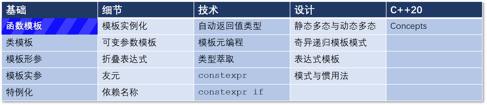

# C++ 模板 3： 有关显式模板参数和概念的更多内容

## 导航

[目录](https://github.com/yqZhang4480/TranslateBlogs/blob/master/CPP_Templates/目录.md)	[上一篇](https://github.com/yqZhang4480/TranslateBlogs/blob/master/CPP_Templates/模板2.md)	[下一篇](https://github.com/yqZhang4480/TranslateBlogs/blob/master/CPP_Templates/模板4.md)	[原文](http://www.modernescpp.com/index.php/function-templates-more-details)

