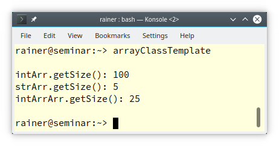

# C++ 模板 4： 类模板


函数模板表示一系列函数的统一表述。同样的，类模板表示一系列类的统一表述。本文将介绍类模板。

## 类模板的定义
假设你有一个 `Array` 类，它应该成为一个类模板。

```C++
class Array
{ 
public:
    int getSize() const
    {
        return 10;
    }
private:
    int elem[10];
};
```

`Array` 类持有一个长度为 10 的 `int` 的 C 风格的数组。 C 风格的数组的类型和它的长度是明显的泛化点。让我们通过引入一个类型参数 `T` 和一个非类型参数 `N` 来做一个类的模板。

```C++
// arrayClassTemplate.cpp
#include <cstddef>                     // (*)
#include <iostream>
#include <string>

template <typename T, std::size_t N>   // (**)
class Array
{
public:
    std::size_t getSize() const
    {
        return N;
    }
private:
    T elem[N];
};

int main()
{
    std::cout << '\n';

    Array<int, 100> intArr;             // (***)
    std::cout << "intArr.getSize(): " << intArr.getSize() << '\n';

    Array<std::string, 5> strArr;       // (****)
    std::cout << "strArr.getSize(): " << strArr.getSize() << '\n';

    Array<Array<int, 3>, 25> intArrArr; // (*****)
    std::cout << "intArrArr.getSize(): " << intArrArr.getSize() << '\n';

    std::cout << '\n';
}
```

数组是由它的类型和它的大小来决定的。对于大小，我使用了无符号整数类型 `std::size_t` (\*\*)，它可以存储最大大小。为了使用 `std::size_t`，我必须包含头文件 `<cstddef>` (\*)。到目前为止，数组可以用 `int`（\*\*\*）、`std::string`（\*\*\*\*）和 `Array<int, 3>`（\*\*\*\*\*）进行实例化。下面的截图显示了该程序的输出。

  

可以在类模板的内部或外部定义模板的成员函数。

## 成员函数的定义 

在类模板中定义成员函数很简单。 

```C++
template <typename T, std::size_t N>   
class Array
{
public:
    std::size_t getSize() const
    {
        return N;
    }
private:
    T elem[N];
};
```

当在类外定义成员函数时，必须指定它是一个模板，同时必须指定类模板的完整类型限定。下面是类模板 `Array` 的在类外定义成员函数的版本：

```C++
template <typename T, std::size_t N> 
class Array
{
public:
    std::sizt_ getSize() const;
private:
    T elem[N];
};
template <typename T, std::size_t N>   // (*)
std::size_t Array<T, N>::getSize() const
{
    return N;
}
```

(\*) 是数组的成员函数 `getSize`，定义在类之外。如果成员函数本身是一个模板，那么在类模板之外定义成员函数就变得非常有挑战性。

## 作为模板的成员函数
通用成员函数的一个典型例子是模板化的赋值运算符。原因很简单，如果 `T` 可以转换到 `T2`，应当允许把一个 `Array<T, N>` 分配给一个 `Array<T2, N>`。但将一个 `Array<float, 5>` 赋值给一个 `Array<double, 5>` 是无效的，因为两个数组的类型不同：

```C++
// arrayAssignmentError.cpp
#include <cstddef>                     
#include <iostream>
#include <string>

template <typename T, std::size_t N>   
class Array
{
public:
    std::size_t getSize() const
    {
        return N;
    }
private:
    T elem[N];
};

int main()
{
    std::cout << '\n';
    Array<float, 5> floatArr;  
    Array<float, 5> floatArr2;
    
    floatArr2 = floatArr;             // (*)
    
    Array<double, 5> doubleArr;       
    doubleArr = floatArr;             // (**)
}
```

将 `floatArr` 分配给 `floatArr2(1)` 是有效的，因为两个数组的类型相同。将 `floatArr` 赋值给 `doubleArr` 是一个错误（(**) 行），因为两个类的类型不同。因此，编译器报错说，没有从 `Array<float, 5>` 转换到 `Array<double, 5>`。

这里有一个 `Array` 类的简单实现，它支持两个相同长度的数组的赋值。C 风格数组 `elem` 是故意暴露出来的。

```C++
template <typename T, std::size_t N>   
class Array
{
public:
    template <typename T2>
    Array<T, N>& operator = (const Array<T2, N>& arr)
    {
        std::copy(std::begin(arr.elem), std::end(arr.elem), std::begin(elem));
        return *this;
    }
    std::size_t getSize() const
    {
        return N;
    }
    T elem[N];
};
```

赋值运算符 `Array<T, N>& operator = (const Array<T2, N>& arr)` 可以接受底层类型不同但长度一样的数组。在展示这段代码的操作之前，先对它进行一些改进。

###  友元

为了使 `elem` 私有，`Array` 对象应当是 `Array` 类的友元：

```C++
template <typename T, std::size_t N>   
class Array
{
public:
    template <typename T2>
    Array<T, N>& operator = (const Array<T2, N>& arr)
    {
        std::copy(std::begin(arr.elem), std::end(arr.elem), std::begin(elem));
        return *this;
    }
    template<typename, std::size_t> friend class Array;          // (*)
    std::size_t getSize() const
    {
        return N;
    }
private:
    T elem[N];
};
```

### 在类外定义的成员函数

在类外定义通用成员函数确实要花上些工夫：

```C++
emplate <typename T, std::size_t N>   
class Array
{
public:
    template <typename T2>
    Array<T, N>& operator = (const Array<T2, N>& arr);
    template<typename, std::size_t> friend class Array;
    std::size_t getSize() const;
private:
    T elem[N];
};
template <typename T, std::size_t N> 
std::size_t Array<T, N>::getSize() const { return N; }

template<typename T, std::size_t N>                // (*)
template<typename T2>
Array<T, N>& Array<T, N>::operator = (const Array<T2, N>& arr) {
    std::copy(std::begin(arr.elem), std::end(arr.elem), std::begin(elem));
    return *this;
}
```

在类的主体之外定义一个通用成员函数 (*)，此时必须指定类和成员函数是模板，然后还必须指定通用成员函数的完整类型限定。到目前为止，赋值运算符是用于可转换的类型 `T` 和 `T2` 的。如果不可转换，调用此函数会产生难看的错误信息。下面就来解决这个问题。

### 对类型参数的要求
这些要求可以用   type traits 库和 `static_assert`（C++11），或者用概念（C++20）来制定。下面是通用赋值运算符的两种修改方案。

* C++ 11

  ```C++
  template<typename T, std::size_t N>
  template<typename T2>
  Array<T, N>& Array<T, N>::operator = (const Array<T2, N>& arr)
  {
      static_assert(std::is_convertible<T2, T>::value,     // (*)
                        "Cannot convert source type into the destination type!");
      std::copy(std::begin(arr.elem), std::end(arr.elem), std::begin(elem));
      return *this;
  }
  ```

* C++ 20

  下面是在声明（\*）和成员函数的定义（\*\*）中使用 `std::convertible_to` 概念的完整代码：

  ```C++
  // arrayAssignment.cpp
  
  #include <algorithm>
  #include <cstddef>                     
  #include <iostream>
  #include <string>
  #include <concepts>
  
  template <typename T, std::size_t N>   
  class Array
  {
  public:
      template <typename T2>
      Array<T, N>& operator = (const Array<T2, N>& arr) requires std::convertible_to<T2, T>;           // (*)
      template<typename, std::size_t> friend class Array;
      std::size_t getSize() const;
  private:
      T elem[N];
  };
  
  template <typename T, std::size_t N> 
  std::size_t Array<T, N>::getSize() const { return N; }
  template<typename T, std::size_t N>
  template<typename T2>
  Array<T, N>& Array<T, N>::operator = (const Array<T2, N>& arr)
      requires std::convertible_to<T2, T>           // (**)
  { 
      std::copy(std::begin(arr.elem), std::end(arr.elem), std::begin(elem));
      return *this;
  }
  
  int main()
  {
      std::cout << '\n';
  
      Array<float, 5> floatArr;  
      Array<float, 5> floatArr2;
      floatArr.getSize();
      
      floatArr2 = floatArr;
      
      Array<double, 5> doubleArr;       
      doubleArr = floatArr;             
  
      Array<std::string, 5> strArr;
      // doubleArr = strArr;                       // (***)
  }
  ```

   当启用 (***) 时，编译器会报错说约束条件没有得到满足。


## 下一篇

本文对类模板的研究是一个开始。下一篇文章将处理两个棘手的细节：类模板的继承和类模板成员函数的实例化。

## 导航

[目录](https://github.com/yqZhang4480/TranslateBlogs/blob/master/CPP_Templates/目录.md)	[上一篇](https://github.com/yqZhang4480/TranslateBlogs/blob/master/CPP_Templates/模板3.md)	[下一篇](https://github.com/yqZhang4480/TranslateBlogs/blob/master/CPP_Templates/模板5.md)	[原文](http://www.modernescpp.com/index.php/class-templates)

