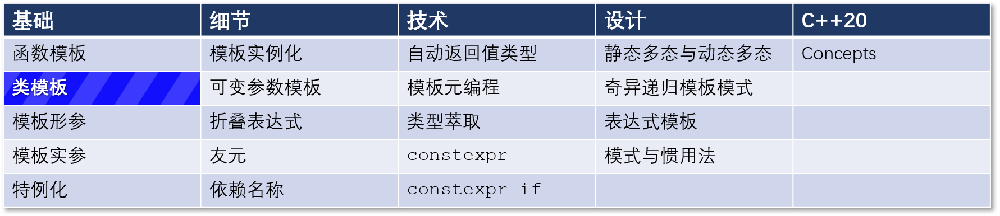
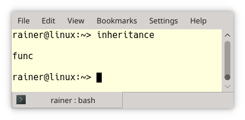
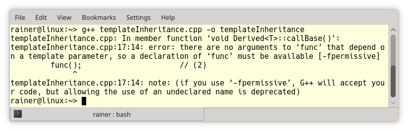
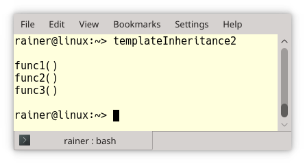
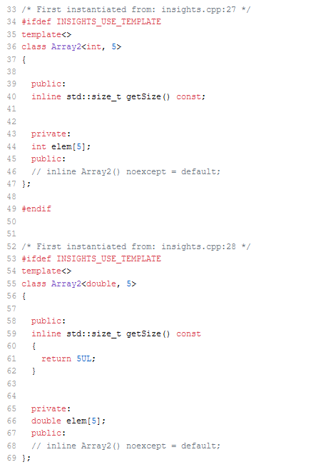
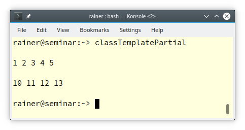
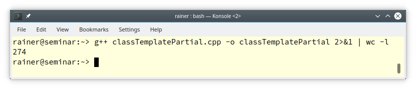

# C++ 模板 5： 类模板的继承和成员函数



上一篇文章介绍了关于这些模板的基本知识。这篇文章说明对类模板的继承和类模板成员函数的实例化中的特性，这些特性可能会令你感到 surprise。

下面是第一个 surprise，至少我是 surprise 了：

## 类模板的继承成员函数不可用

来看一个简单的例子：

```C++
// inheritance.cpp
#include <iostream>
class Base
{
public:
    void func()                     // (1)
    {                    
        std::cout << "func\n";
    }
};
class Derived : public Base
{
public:
    void callBase()
    {
        func();                      // (2)
    }
};

int main()
{
    std::cout << '\n';
    Derived derived;
    derived.callBase();              
    std::cout << '\n';
}
```

上面的代码实现了类 `Base` 和 `Derived`。`Derived` 是从 `Base` 公共派生出来，因此可以在其成员函数 `callBase`（(2) 行）中使用类 `Base` 的方法 `func`。程序的输出如下，我没有什么要补充的。 

让 `Base` 成为类模板完全改变了程序行为。

```C++
// templateInheritance.cpp
#include <iostream>
template <typename T>
class Base
{
public:
    void func()            			// (1)
    {                    
        std::cout << "func\n";
    }
};
template <typename T>
class Derived: public Base<T>
{
public:
    void callBase()
    {
        func();                       // (2)
    }
};

int main()
{
    std::cout << '\n';
    Derived<int> derived;
    derived.callBase();              
    std::cout << '\n';
}
```

我猜编译器的报错会让你 surprise。  

错误信息中的 `there are no arguments to 'func' that depend on a template parameter, so a declaration of 'func' must be available` 给出了第一个提示。`func` 是一个非依赖名称，即它的名称不依赖于模板参数 `T`。非依赖性名称在模板定义时被查找和绑定，只有依赖名称在模板实例化时被查找和绑定。因此，编译器不会在依赖 `T` 的基类 `Base<T>` 中查找，在类模板之外也没有 `func` 这个名字。

这个过程叫做[两阶段查找（Two-phase lookup）](https://stackoverflow.com/questions/7767626/two-phase-lookup-explanation-needed)。第一阶段专门负责查找非依赖名称；第二阶段负责查找依赖名称。

有三种方法可以将名称查询扩展到依赖的基类。下面的例子用到了这三种方法。

```C++
// templateInheritance2.cpp
#include <iostream>

template <typename T>
class Base
{
public:
  void func1() const
  {
    std::cout << "func1()\n";
  }
  void func2() const
  {
    std::cout << "func2()\n";
  }
  void func3() const
  {
    std::cout << "func3()\n";
  }
};
template <typename T>
class Derived: public Base<T>
{
public:
  using Base<T>::func2;              // (2)
  void callAllBaseFunctions()
  {
    this->func1();                   // (1)
    func2();                         // (2)
    Base<T>::func3();                // (3)
  }
};

int main()
{
  std::cout << '\n';

  Derived<int> derived;
  derived.callAllBaseFunctions();

  std::cout << '\n';
}
```

1. **使名称具有依赖性。**第 (1) 行的调用 `this->func1` 是依赖性的，这是隐式依赖。在这种情况下，名称查找将考虑所有的基类。
2. **将名字引入到当前的作用域中。**使用 `Base<T>::func2` 的表达式（第 (2) 行）将 `func2` 引入当前作用域。
3. **完全限定地调用名称。** 完全限定地调用 `func3`（第 (3) 行）会破坏虚调用，带来新的 surprise。

应该用哪种方法？一般来说，我更喜欢第一个，即 `this->func1`。当基类需要重命名时，这个方法也不会失效。

最后，程序输出如下：



## 成员函数实例化的惰性规则
类模板的成员函数的实例化只在需要时发生。请看：

```C++
// lazy.cpp
#include <iostream>

template<class T> 
struct Lazy
{
    void func() { std::cout << "func\n"; }
    void func2(); // not defined (1)
};

int main()
{
  std::cout << '\n';
  Lazy<int> lazy;
  lazy.func();
  std::cout << '\n';
}
```

尽管 `Lazy` 类的成员函数 `func2()` (1) 只被声明而没有定义，但编译器接受了这个程序，因为没有必要定义 `func2`。

成员函数实例化过程的这种惰性有两个值得提到的特性。

### 节约资源

例如，当你实例化对各种类型的类模板 `Array2`，只有使用的成员函数被实例化了。对于非模板类 `Array1` 来说，这种惰性并不存在。请看这个用 C++ Insights 展示的例子。

```C++
// lazyInstantiation.cpp
#include <cstddef> 

class Array1
{
public:
    int getSize() const
    {
        return 10;
    }
private:
    int elem[10];
};
template <typename T, std::size_t N>
class Array2
{
public:
    std::size_t getSize() const
    {
        return N;
    }
private:
    T elem[N];
};

int main()
{
    Array1 arr;

    Array2<int, 5> myArr1;
    Array2<double, 5> myArr2;   // (1) 
    myArr2.getSize();           // (2) 
}
```

类模板 `Array2` 的成员函数 `getSize()` 只对 `myArr2` (1) 进行了实例化。这个实例化是由调用 `myArr2.getSize()` (2) 引起的。 [C++ Insights](https://cppinsights.io/s/451db374) 展示了这一过程。以下截图中的关键是第 40 行和 59 行。



### 类模板的部分使用
实例化类模板时，可以使用不支持所有成员函数的模板实参。只要不调用不支持的成员函数，编译器就不会报错。

```C++
// classTemplatePartial.cpp
#include <iostream>
#include <vector>

template <typename T>         // (1) 
class Matrix
{
public:
    explicit Matrix(std::initializer_list<T> inList) : data(inList)  {}
    void printAll() const     // (2)
    {   
        for (const auto& d : data) std::cout << d << " ";
    }
private:
    std::vector<T> data;
};

int main()
{
    std::cout << '\n';

    const Matrix<int> myMatrix1({ 1, 2, 3, 4, 5 });
    myMatrix1.printAll();   // (3) 

    std::cout << "\n\n";

    const Matrix<int> myMatrix2({ 10, 11, 12, 13 });
    myMatrix2.printAll();  // (4) 

    std::cout << "\n\n";
    const Matrix<Matrix<int>> myMatrix3({ myMatrix1, myMatrix2 });
    // myMatrix3.printAll(); ERROR (5)
}
```

类模板 `Matrix` (1) 有一个类型参数 `T`，用 `std::vector` 保存数据，并且可以通过 `std::initalizer_list` 进行初始化。`Matrix` 支持成员函数 `printAll()` 来显示其所有成员。(3) 和 (4) 显示了它的用法。输出操作符没有为 `Matrix` 重载。因此，虽然我们可以创建由其他 `Matrix` 对象作为成员的 `myMatrix3`，但不能显示它们 (5)。

  

启用 (5) 会导致一个相当冗长的错误信息，大约有 274 行：

  

## 下一篇
下一篇文章将介绍关于别名模板和模板形参的内容。

## 导航

[目录](目录.md)	[上一篇](模板4.md)	[下一篇](模板6.md)	[原文](http://www.modernescpp.com/index.php/surprise-included-inheritance-and-member-functions-of-class-templates)

