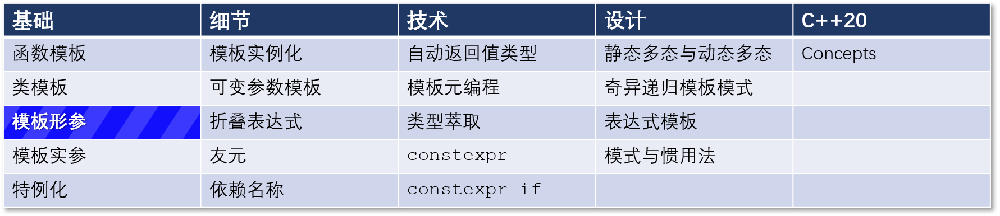
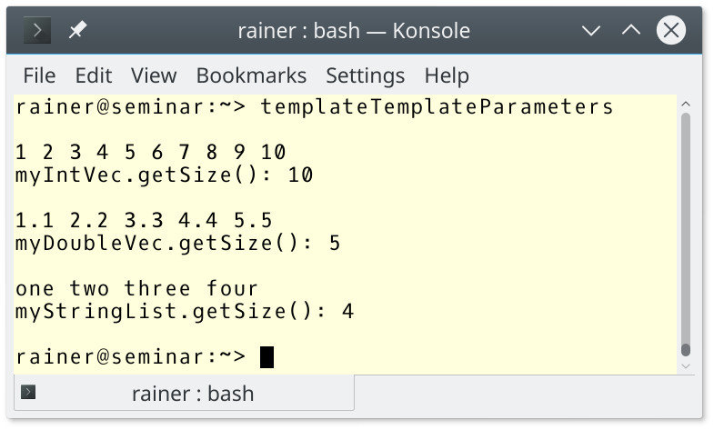

# C++ 模板 6： 别名模板和模板形参



本文说明两个主题：别名模板和模板形参。别名模板是给类型模板命名的一种方式。模板形参可以是类型、非类型、模板。

## 别名模板

别名模板是 C++11 中的新特性。别名模板提供了一种方法，可以给一个类型家族起一个方便的名字。下面的代码片段给出了类模板 `Matrix` 的定义。

```C++
template <typename T, int Line, int Col>
class Matrix { ... };
```

`Martix` 需要三个模板形参，类型参数 `T`，非类型参数 `Line` 和 `Col`。

为了代码的可读性，我想给出两种特殊的矩阵：`Square` 和 `Vector`，分别表示行数和列数相等的矩阵，和行数为 1 的矩阵。类型别名可以帮助实现这样的想法：

```C++
template <typename T, int Line>
using Square = Matrix<T, Line, Line>; // (1)

template <typename T, int Line>
using Vector = Matrix<T, Line, 1>;    // (2)
```

关键字 `using`（(1) 和 (2)）声明了类型别名。虽然模板 `Matrix` 可以在三个维度 `T`、`Line` 和 `Col` 中进行参数化，但类型别名 `Square` 和 `Vector` 将参数化减少到两个维度 `T` 和 `Line`。从这个角度来看，别名模板能够为部分绑定的模板创建直观的名称。使用 `Square` 和 `Vector` 简单直观：

```C++
Matrix<int, 5, 3> ma;
Square<double, 4> sq;
Vector<char, 5> vec;
```

别名模板的一个很好的使用案例是[类型萃取（type-traits）](https://en.cppreference.com/w/cpp/header/type_traits)库。

### 类型萃取库

当你在值 `arg` 上应用 `std::move(arg)` 时，编译器通常使用 `std::remove_reference` 来根据其基础类型删除引用。

```C++
static_cast<std::remove_reference<decltype(arg)>::type&&>(arg);   // (1)
static_cast<std::remove_reference_t<decltype(arg)>&&>(arg);       // (2)
```

版本 (2) 从 C++14 开始有效。`std::remove_reference_t` 的定义如下：

```C++
template<class T>
using remove_reference_t = typename remove_reference<T>::type;
```

这就是一个别名模板。

回过头来说，之前定义的类模板 `Matrix` 使用了两个非类型模板形参 `Line` 和 `Col`。

## 模板形参

 模板形参可以是类型，非类型，模板。

### 类型

类型是最经常使用的模板形参。下面是几个例子。

```C++
std::vector<int> myVec;
std::map<std::string, int> myMap;
std::lock_guard<std::mutex> myLockGuard;
```

### 非类型

非类型形参可以是：

* 左值引用
* `nullptr`
* 指针值
* 枚举类型的值
* 整型值
* 浮点型值（C++20）

整型值是最常用的非类型形参。典型的例子 是`std::array`，因为在编译时必须指定 `std::array` 的大小。

```C++
std::array<int, 3> myArray{1, 2, 3};
```

### 模板
模板也可以是模板形参。它们的定义可能看起来有点奇怪。

```C++
// templateTemplateParameters.cpp
#include <iostream>
#include <list>
#include <vector>
#include <string>

template <typename T, template <typename, typename> class Cont >      // (1)
class Matrix
{
public:
    explicit Matrix(std::initializer_list<T> inList) : data(inList)   // (2)
    {
        for (auto d : data) std::cout << d << " ";
    }
    int getSize() const
    {
        return data.size();
    }
private:
    Cont<T, std::allocator<T>> data;                                  // (3)                               

};

int main()
{
    std::cout << '\n';

    // (4)
    Matrix<int, std::vector> myIntVec{ 1, 2, 3, 4, 5, 6, 7, 8, 9, 10 };
    std::cout << '\n';
    std::cout << "myIntVec.getSize(): " << myIntVec.getSize() << '\n';

    std::cout << std::endl;

    Matrix<double, std::vector> myDoubleVec{ 1.1, 2.2, 3.3, 4.4, 5.5 }; // (5)
    std::cout << '\n';
    std::cout << "myDoubleVec.getSize(): " << myDoubleVec.getSize() << '\n';

    std::cout << '\n';
    // (6)
    Matrix<std::string, std::list> myStringList{ "one", "two", "three", "four" };
    std::cout << '\n';
    std::cout << "myStringList.getSize(): " << myStringList.getSize() << '\n';

    std::cout << '\n';
}
```

`Matrix` 是一个简单的类模板，可以通过 `std::initializer_list`（(2)）进行初始化。`Matrix` 可以与 `std::vector`（(4) 和 (5)）或 `std::list`（(6)）一起使用，以保存其值。到目前为止，没有什么特别之处。

  

但是请注意，我没有提到 (1) 和 (3)。(1) 声明了一个类模板，它有两个模板形参，第一个是元素的类型，第二个代表容器。我们仔细看看第二个形参：`template <typename, typename> class Cont>`。这意味着第二个模板形参应该是一具有两个模板形参的模板。第一个模板形参是容器存储的元素的类型，第二个模板形参是标准模板库的容器所默认的分配器。甚至分配器也有一个默认值，比如在 `std::vector` 的情况下。分配器取决于元素的类型。

(3) 展示了分配器在这个内部使用的容器中的用法。`Martix` 可以使用所有的容器，这些容器的类型是：`container<type of the elements, allocator of the elements>`。`std::vector`、`std::deque`、`std::list`等序列容器是如此。`std::array` 和 `std::forward_list` 会失败，因为 `std::array` 需要一个额外的非类型来在编译时指定其大小，而 `std::forward_list` 不支持 `size` 函数。

也许你不喜欢用关键词 `class` 作为模板参数的名称。在C++17中，你可以用 `typename`代替 `class`。

## 下一篇

下一篇文章将说明模板实参。编译器推断类型的过程相当有趣，这些规则不仅适用于函数模板（C++98），也适用于 `auto`（C++11）、类模板（C++17）和概念（C++20）。

## 导航

[目录](目录.md)	[上一篇](模板5.md)	[下一篇](模板7.md)	[原文](http://www.modernescpp.com/index.php/alias-templates-and-template-parameters)

