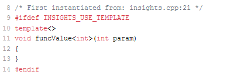
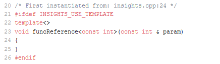
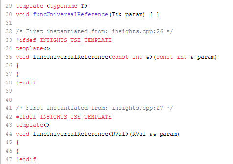
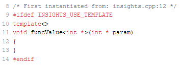
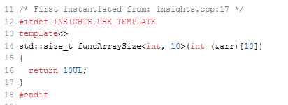
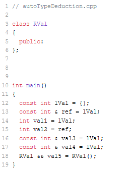

# C++ 模板 7：模板实参


本文说明模板实参。编译器推断类型的过程相当有趣，这些规则不仅适用于函数模板（C++98），也适用于 `auto`（C++11）、类模板（C++17）和概念（C++20）。

C++ 从一开始就支持函数模板参数推导。下面简短回顾一下。

## 函数模板参数推导

分别调用参数为 `int` 和 `double` 的函数模板：

```C++
template <typename T>
T max(T lhs, T rhs) {
    return (lhs > rhs)? lhs : rhs;
}

int main() {
  
    max(10, 5);         // (1)
    max(10.5, 5.5);     // (2)
  
}
```

在这种情况下，编译器从函数参数中推断出模板参数。C++ Insights 显示，编译器为`int` (1) 和 `double` (2) 的 `max` 创建了一个完整的专用函数模板。

  

像这种情况下的模板类型推导过程，大多数时候产生的是预期的类型。深入分析这个过程很有启发性。

## 模板类型推导

**（译注：这一部分与《Effective Modern C++》条款 1 基本相同。）**

在推断模板类型时，有三个实体在起作用。`T`，`ParameterType`，和 `expression`。

```C++
template <typename T>
void func(ParameterType param);

func(expression);
```

需要推断的部分有二:

- `T`
- `ParameterType`

其中 `ParameterType` 可以是：

- 值类型
- 引用类型 (&) 或指针类型 (*)
- 通用引用 (&&)

`expression` 可以是一个左值或一个右值。也可以是一个引用，也可以被 `const`、`volatile` 修饰。

了解模板类型推导过程的最简单方法是改变 ` ParameterType`。

### `ParameterType` 是值类型

这种情形最为常见。

```C++
template <typename T>
void func(T param);

func(expression);
```

此时遵循的规则是：

* 当 `expression` 是引用时，引用限定词会被丢弃，会创建一个新的对象。
* 当传入的对象带有 `const` 或 `volatile` 限定词，这些限定词也会被丢弃。 

在下面会说到，如果 `ParameterType` 是一个引用或一个通用引用，那么 `expression` 的 constness 和 volatileness 将得到应有的尊重。

### `ParameterType` 是引用类型 (&) 或指针类型 (*)

为了简单起见，我使用一个引用。类似的论证也适用于指针。从本质上讲，你完全可以得到你期望的结果。

```C++
template <typename T>
void func(T& param);
// void func(T* param);

func(expr);
```

- 当 `expr` 是一个引用时，引用会被忽略。

- `expr` 与 `ParameterType` 匹配，产生的类型成为引用。这意味着
- 对于 `int` 类型的 `expr`，`ParameterType` 为 `int&`。
  - 对于 `const int` 类型的 `expr`，`ParameterType` 为 `const int&`。
- 对于 `const int&` 类型的 `expr`，`ParameterType` 为 `const int&`。

### `ParameterType` 是通用引用（&&，也称万能引用）

```C++
template <typename T>
void func(T&& param);

func(expr);
```

- `expr` 为左值时，`ParameterType` 为左值引用类型。
- `expr` 为右值时，`ParameterType` 为右值引用类型。

（关于通用引用，可见文末译注。）

诚然，这样的解释比较抽象，下面结合代码来说明：

```C++
// templateTypeDeduction.cpp

template <typename T>
void funcValue(T param) { }

template <typename T>
void funcReference(T& param) { }

template <typename T>
void funcUniversalReference(T&& param) { }

class RVal{};

int main() {

    const int lVal{};
    const int& ref = lVal;
  
    funcValue(lVal);                  // (1)
    funcValue(ref);
  
    funcReference(lVal);              // (2)
  
    funcUniversalReference(lVal);     // (3)
    funcUniversalReference(RVal());

}
```

我定义并使用了若干函数模板，通过值（1）、引用（2）和通用引用（3）来获取其参数。

下面是 [C++ Insights](https://cppinsights.io/s/6bb71783) 的输出。

(1): 对 `funcValue` 的两次调用都会导致函数模板的相同实例化。推断出的类型是 `int`。

(2): 用 `const int&` 调用函数 `funcReference` 得到的类型是 `const int&`。

(3): 使用函数 `funcUniversalReference` 给出一个左值引用或右值引用。

讲完这些，还剩一个有趣的小问题：C 风格数组（C-array）的退化。

### C 风格数组的退化

```C++
// typeDeductionArray.cpp

template <typename T>
void funcValue(T param) { }

int main() {

    int intArray[10]{ 0, 1, 2, 3, 4, 5, 6, 7, 8, 9};

    funcValue(intArray);
    
}
```

当你用一个 C 风格数组调用函数模板 `funcValue` 时，C 风格数组会退化为一个指向其第一个元素的指针。

退化除了指数组到指针的隐式转换，还有很多方面。当一个函数实参以值传递时会发生退化，函数会退化到函数指针、数组会退化到指针、左值会退化到右值。同时，实参的引用限定符和 `const/volatile` 限定符会被移除。

[C++ Insights](https://cppinsights.io/s/910a53e4) 的输出如下图。



这个现象本质上是因为我们不知道 C 风格数组的大小。

但是有一个技巧。通过引用 C 风格数组，对 C 风格数组的类型和大小进行匹配，就可以得到 C 风格数组的大小。

```C++
// typeDeductionArraySize.cpp

#include <cstddef>
#include <iostream>

template <typename T, std::size_t N>
std::size_t funcArraySize(T (&arr)[N]) { 
    return N;
}

int main() {

    std::cout << '\n';

    int intArray[10]{ 0, 1, 2, 3, 4, 5, 6, 7, 8, 9};

    funcArraySize(intArray);

    std::cout << "funcArraySize(intArray): " << funcArraySize(intArray) << '\n';

    std::cout << '\n';
    
}
```

函数模板 `funcArraySize` 推导出 C 风格数组的大小。 出于可读性的考虑，我给C-数组的参数命名为 `arr`： `std::size_t funcArraySize(T (&arr)[N])`。这并非必须，你可以直接写 `std::size_t funcArraySize(T (&)[N])`。 下面是来自 [C++ Insights](https://cppinsights.io/s/6e908572) 的输出。



此程序会输出10。

## `auto` 关键字的类型推导

当你理解了模板类型推导，你基本上就理解了 C++11 中 `auto` 关键字的类型推导。

`auto` 关键字的类型推导使用的是与模板类型推导相同的规则。

这里我重复一下模板类型推导的基本要素：

```C++
template <typename T> 
void func(ParameterType param);

auto val = 2022;
```

要理解 `auto`，你需要把 `auto` 看作是 `T` 的替代物，把类型限定符看作是函数模板中 `ParameterType` 的替代物。

类型限定符是值类型 (1)、引用类型 (2)、通用引用类型 (3)。

```C++
auto   val = arg;      // (1)
auto&  val = arg;      // (2)
auto&& val = arg;      // (3)
```

让我们来试试，改变之前的程序（templateTypeDeduction.cpp），用 `auto` 代替函数模板。

```C++
// autoTypeDeduction.cpp

class RVal{};

int main() {

    const int lVal{};
    const int& ref = lVal;
  
    auto val1 = lVal;          // (1)
    auto val2 = ref;
  
    auto& val3 = lVal;         // (2)
  
    auto&& val4 = lVal;        // (3)
    auto&& val5 = RVal();

}
```

当你在 [C++ Insights](https://cppinsights.io/s/2c652b47) 中研究产生的类型时，你会发现它们与程序 templateTypeDeduction.cpp 中推导出的类型完全相同。



## 下一篇
C++17 使类型演绎变得更加强大。首先，对于非类型的模板参数可以进行自动类型推导；其次，类模板也可以推导其参数。特别是，类模板参数推导使程序员的生活变得更加轻松。（译注：终于翻译完了。）

## 译注：关于引用折叠和通用引用

我搬运一下我在读《Effective Modern C++》时写的唯一一篇（(～￣▽￣)～）笔记。

### 条款 28：引用折叠

对于下面的函数模板及其调用：

``` C++
template<typename T>
void func(T&& param);
……
int i = 717;
func(i);
```

当向此函数模板传入左值时，T的类型被推导为 `int&`。此时函数模板产生了这样的实例：

```C++
void func(int& && param);
```

形参 `param` 拥有了两个引用饰词，也就产生了引用的引用。由于 C++ 不存在引用的引用，因此编译器必须处理这种情况。

编译器采取的处理方法是，将两个引用饰词合成为一个。如果任一引用为左值引用，则合成的结果为左值引用。只用两个引用都是右值引用时，结果才是右值引用。这就是**引用折叠**机制。

### 条款 24：通用引用

引用折叠机制带来了一个非常有用的东西，有用到被称为**通用引用**（书上叫万能引用），其表示形式为 `T&&`。通常来说，`&&` 表示右值引用，但在这里并非如此，它表示“要么是左值引用，要么是右值引用”。搞清楚这一点后，我们就可以看到通用引用到底通用在哪里。例如上面提到的函数模板可以很好地应对各种实参，

* 实参为左值时，T被推导为左值引用类型，形参经过引用折叠得到左值引用类型；
* 实参为右值时，T被推导为值类型，形参得到右值引用类型。

通用引用不但可以绑定左值或右值，也可以绑定 `const` 或 `volatile` 修饰的对象，具体情况见下表。其中，第一列是函数模板声明时的形参类型；第一行是传入的实参的类型；表格内容是函数模板实例化得到的形参的类型。

|          | int 左值或引用 | int 右值   | const int 左值或引用 | volatile int 左值或引用 | const volatile int 左值或引用 |
| -------- | -------------- | ---------- | -------------------- | ----------------------- | ----------------------------- |
| T        | int            | int        | int                  | int                     | int                           |
| T&       | int&           | -          | const int&           | volatile int&           | const volatile int&           |
| const T& | const int&     | const int& | const int&           | const volatile int&     | const volatile int&           |
| T&&      | int&           | int&&      | const int&           | volatile int&           | const volatile int&           |

结论很明显，通用引用能够接受各种形参，同时能最大程度上保持实参的类型修饰符。

关于通用引用的最后一点是通用引用的限定条件。当满足两个条件时，才可能存在通用引用：

* 严格形如 `T&&` 的格式；
* `T` 涉及类型推导。

例如下面几例就不是通用引用：

```  C++
template<typename T>
void func(std::vector<T>&& param);
// ^^^ 不满足 T&& 的形式

template<typename T>
void func(const T&& param);
// ^^^ 不满足 T&& 的形式

template<typename T>
class A {
public:
	void func(T&& param);    
}
// ^^^ T的类型是用户显式给出的，不涉及类型推导

```

此时，&&表示右值引用。

进一步说，`auto&&` 也是一个通用引用。一来它符合 `T&&` 的格式，只不过 `T` 换成了 `auto`；二来 `auto` 也确实涉及类型推导。

关于以上这些，还可以参考这篇文章： [Universal References in C++11 -- Scott Meyers : Standard C++ (isocpp.org)](https://isocpp.org/blog/2012/11/universal-references-in-c11-scott-meyers) 。

## 导航

[目录](目录.md)	[上一篇](模板6.md)	[下一篇](模板8.md)	[原文](http://www.modernescpp.com/index.php/template-arguments)

