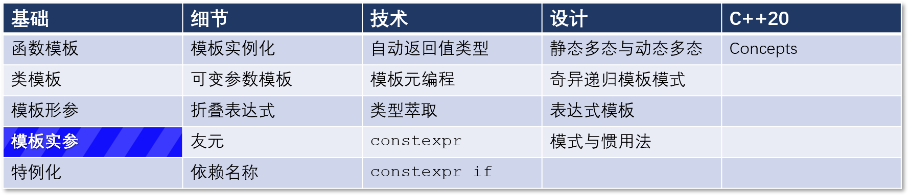

# C++ 模板 8：类模板的模板参数推导



在上一篇文章中，我写了关于函数模板类型推导（C++98）和 `auto` 类型推导（C++11）。今天我戴上了更现代的帽子。本文将从非类型模板参数和类模板的类型推导开始（C++17），以概念的类型推导结束（C++20）。
按照时间顺序，从两个 C++17 的特征开始：非类型模板形参的类型推导和 C++17 中类模板的类型推导。

## 非类型模板形参的类型推导

首先，什么是非类型的模板形参？非类型的模板形参可以是 `nullptr`，`bool`/`int` 等整型值，左值引用，指针，枚举值，C++20 还支持浮点型值。整型值的使用最为常见。

说完这个理论，让我们从一个例子开始。

```C++
template <auto N>          // (1)
class MyClass{
    ....
};

template <int N>          // (2)
class MyClass<N> {
    ....
};


MyClass<'x'> myClass1;    // (3)
MyClass<2017> myClass2;   // (4)
```

在模板签名（1）中使用中 `auto`，`N` 是一个非类型模板形参。编译器会自动推导出它。你也可以对此类接受 `int` 类型的非类型模板形参的情形进行偏特化处理（2）。模板实例化（3）将使用模板（1），下面的模板实例化（4）将使用偏特化的模板（2）。

类型限定符可以用来约束非类型模板形参的类型。

```
template <const auto* p> 
class S;
```

在这个类模板 `S` 的声明中，`p` 必须是 `const ` 指针。

非类型模板形参的类型推导也适用于可变参数模板：

``` C++
template <auto... ns> 
class VariadicTemplate{ .... }; 

template <auto n1, decltype(n1)... ns>
class TypedVariadicTemplate{ .... };
```

`VariadicTemplate` 可以推导出任意数量的非类型模板形参。`TypeVariadicTemplate` 将只推导出第一个模板形参。其余的模板形参将是和第一个形参相同的类型 `decltype(n1)`。

类模板的自动类型推导使得使用类模板相当舒适。

## 类模板的自动类型推导

一个函数模板可以从其函数实参中推导出其类型形参。但是对于特殊的函数：类模板的构造函数来说，这是不可能的。但在 C++17 中，这种说法是完全错误的：一个构造函数可以从它的函数实参中推导出其类型形参。下面是第一个例子。

```C++
// templateArgumentDeduction.cpp

#include <iostream>

template <typename T>
void showMe(const T& t) {
    std::cout << t << '\n';
}

template <typename T>
struct ShowMe{
    ShowMe(const T& t) {
        std::cout << t << '\n';
    }
};

int main() {
  
    std::cout << '\n';
    
    showMe(5.5);          // not showMe<double>(5.5);
    showMe(5);            // not showMe<int>(5);
    
    ShowMe(5.5);          // not ShowMe<double>(5.5);
    ShowMe(5);            // not ShowMe<int>(5);
  
    std::cout << '\n';
    
}
```

请看这段代码的主函数。函数模板 `showMe` 的实例化从 C++98 开始有效，但类模板 `ShowMe` 的实例化直到 C++17 才可行。从用户的角度来看，函数模板或类模板的使用感觉就像一个普通的函数或类。

或许你不太相信。下面是更多的例子。

```C++
// classTemplateArgumentDeduction.cpp

#include <array>
#include <vector>
#include <mutex>
#include <memory>

int main() {
  
    std::array myArr{1, 2, 3};          // deduces std::array<int, 3> 
    std::vector myVec{1.5, 2.5};        // deduces std::vector<double>
 
    std::mutex mut;
    std::lock_guard myLock(mut);       // deduces std::lock_guard<mutex>(mut);
  
    std::pair myPair(5, 5.5);          // deduces std::pair<int, double>
    std::tuple myTup(5, myArr, myVec); // deduces std::tuple<int, 
                                       // std::array<int, 3>, std::vector<double>>
}
```

这些例子都是可行的，注释说明了 C++17 编译器推导类型的方法。

对 `std::pair` 和 `std::tuple` 的最后两个例子相当有趣。在 C++17 之前，我们使用工厂函数如 `std::make_pair` 或 `std::make_tuple` 来创建一个 `std::pair` 或 `std::tuple`，而不需要指定类型参数。与类模板不同的是，编译器可以从函数参数中推断出类型参数。下面是一个简化版的 `std::make_pair`。

```C++
// makePair.cpp
#include <utility>

template<typename T1, typename T2>
std::pair<T1, T2> make_pair2(T1 t1, T2 t2) { 
    return std::pair<T1, T2>(t1, t2); 
}

int main() {
	
   auto arg{5.5};
   auto pair1 = std::make_pair(5, arg);
   auto pair2 = make_pair2(5, arg);
   auto pair3 = std::pair(5, arg);
   
}
```

编译器为 `pair1` 和 `pair2` 推导出相同的类型。在 C++17 中，我们不再需要这个工厂函数，可以直接调用 `std::pair` 的构造函数来得到 `pair3`。

你可能会发现，我的函数模板 `make_pair2` 是按值取参数的。这是因为 `std::make_pair` 会退化它的参数，所以我的函数模板 `make_pair2` 也是如此。 我在上一篇文章模板参数中写过函数参数的退化问题。

## 使用概念（Concept）的自动类型推导

在我写一些关于用概念进行自动类型推导的文字之前，我想明确强调的是，自动类型推导不仅仅是一种便利，更是一种安全保证。**当你不指定类型时，你就不会犯错。**

使用概念的自动类型推导符合预期。

```C++
// typeDeductionConcepts.cpp

#include <concepts>

void foo(auto t) {}                  // (1)

void bar(std::integral auto t){}     // (2)

template <std::regular T>            // (3)
struct Class{
  Class(T){}
};

int main() {

    foo(5.5);
    bar(5);
    Class cl(true);

}
```

无论你使用的是无限制的占位符（(1) 中的 auto）、有限制的占位符（(2) 中的概念），还是有限制的模板参数（(3) 中的概念），编译器都会推断出预期的类型。

（译注：auto 类型的函数形参是 C++20 的新特性，称为简写函数模板。参见：https://devblogs.microsoft.com/cppblog/abbreviated-function-templates-and-constrained-auto/）

## 下一篇

下一篇文章将叙述模板的下一个令人兴奋的功能：特例化。你可以完全特例化一个函数模板或类模板。一个类模板也可以部分特例化。

## 导航

[目录](目录.md)	[上一篇](模板7.md)	[下一篇](模板9.md)	[原文](http://www.modernescpp.com/index.php/template-argument-deduction-of-class-templates)

