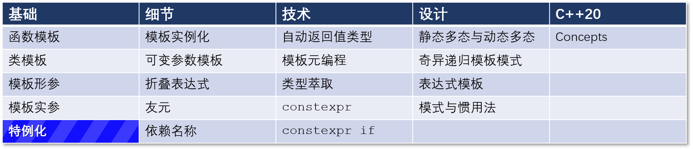

# C++ 模板 9：模板特例化



首先模板专业化的一般概念开始这篇文章，在下一篇文章再集中讨论细节问题。

## 模板特例化

模板定义了一系列类和函数的行为。通常情况下，需要对特殊类型或非类型进行特殊处理。因此，你可以将模板完全特例化（下称全特化）。

类模板也可以部分特例化（下称偏特化）。未经特化的模板（下称主模板）可以全特化或偏特化的模板共存。特例化的类的成员不一定要与未特化模板的成员相同。编译器比起全特化的模板更【喜欢】偏特化的模板，比起偏特化的模板更【喜欢】主模板。

下面的例子应该可以讲清楚这段话。

```C++
template <typename T, int Line, int Column>     // (1)
class Matrix;

template <typename T>                           // (2)
class Matrix<T, 3, 3>{};

template <>                                     // (3)
class Matrix<int, 3, 3>{};
```

* 主模板
  第1行是主模板。主模板必须在部分或全特化模板之前声明。如果不需要主模板，像第 (1) 行这样的声明就可以了。

* 偏特化
  第 (2) 行是偏特化模板。只有类模板支持偏特化。一个偏特化模板有模板形参和明确指定的模板实参。在这个例子中，类 `Matrix<T, 3, 3>` 的 `T` 是模板形参，数字是模板实参。

* 全特化
  第 (3) 行是全特化模板。“全”意味着所有的模板实参都已明确，模板形参列表为空：正如第 (3) 行的 `template <>` 所示。

## 偏特化与全特化的对比

Now, I apply my visual explanation to the class template Matrix and its partial and full specialization. In the primary template (line 1) you can choose a type as a template parameter, and two int values as non-type template parameters. In the case of the partial specialization in line 2, you can only choose the type. This means the 3-dimensional space is reduced to a line. The partial specialization of the primary template Matrix is, therefore, a subspace of the 3-dimensional space. The full specialization (line 3) stands for a point in the 3-dimensional space. 

What is happening when you invoke the templates?

为了更好地理解偏特化与全特化，我想提出一个直观的解释。你可能知道，在数学计算中可能会有很多线性方程组需要求解。

考虑用一个有参数的类模板来描述n维空间。其偏特化是n维空间中的一个子空间，而其全特化是n维空间中的一个点。

现在，我把我的视觉解释应用到类模板Matrix和它的部分和完全专业化。在初级模板中（第1行），你可以选择一个类型作为模板参数，以及两个int值作为非类型模板参数。在第2行的部分特殊化的情况下，你只能选择类型。这意味着3维空间被简化为一条线。因此，主模板Matrix的部分特殊化是3维空间的一个子空间。完全专业化（第3行）代表3维空间的一个点。

当你调用模板时发生了什么？


## 导航

[目录](目录.md)	[上一篇](模板8.md)	[下一篇](10.md)	[原文](http://www.modernescpp.com/index.php/template-specialization)

